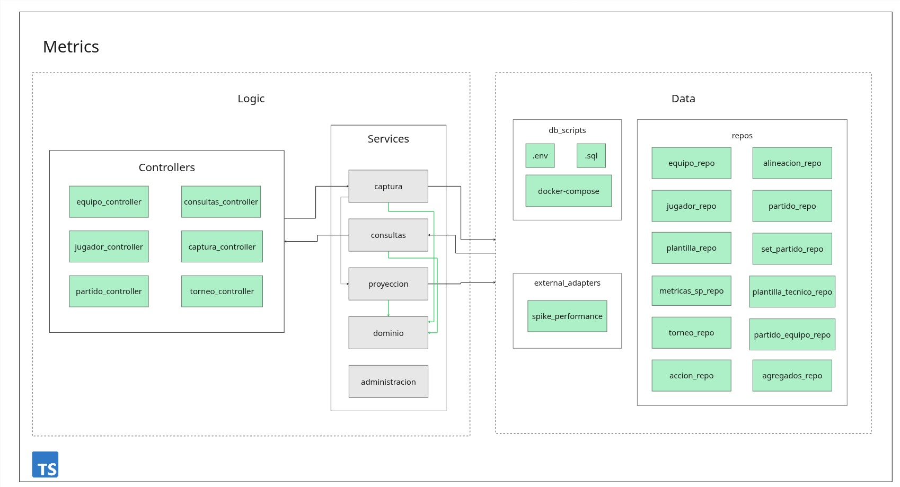
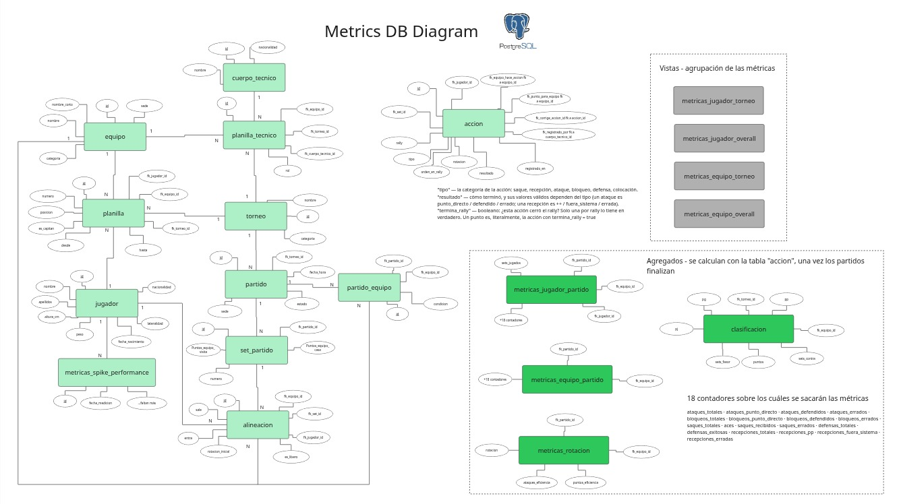
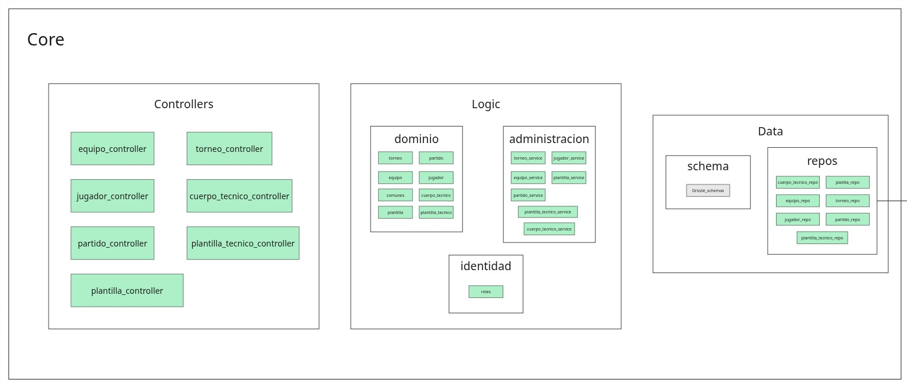

Notas sobre la implmentación real de la aplicación (considero que es mejor hacerlo en un documento aparte
a la documentación final. La docu final la dejaré como ente descriptivo de los releases, varios elementos presentes
acá aparecerán en la documentación final.)

## Arquitectura
De momento se trabajará en el diseño del dominio Metrics. Streaming y On-demand se trabajarán en futuros sprints.

Este es un primer vistazo al diseño del dominio Metrics:

La idea es conseguir un Monolito simple pero que no presente complicaciones si en un futuro se necesita escalar o adaptar la plataforma
a cierto ambiente. Por eso se tiene una estructura de tres capas independientes (Presentation, Logic y Data. Presentation no aparece en la figura).
Se busca mantener la lógica central de la aplicación `Services` lo más desacoplada de las capas externas.

### Diseño de Services
Acá se implementa la estrategia de diseño **CQRS (Command Query Responsibility Segregation)** donde la lógica se divide en escritura (captura) y lectura (consultas). `captura` y `consultas` no se conocen entre sí. No se llaman. Se comunican solo a través de la base de datos —uno deja datos, el otro los recoge— y `proyeccion` es lo que transforma unos en otros. `dominio` es el corazón de la lógica de negocio.

Acá hay una explicación un poco más detallada de `dominio` y `proyeccion`:

`dominio`: Es código puro que sabe de voleibol y de nada más.
Contiene lo siguiente:

- **Los tipos**: qué es una acción, los tipo posibles (saque, ataque…), los resultado posibles, la rotación como 1–6, la forma de los contadores.
- **Las reglas**: que un ataque solo puede ser punto_directo/defendido/error, que la rotación va 1→2→…→6→1, que un rally se cierra exactamente una vez.
- **Las fórmulas puras**: dada una lista de acciones, contar los agregados; dada una lista de contadores, calcular la eficiencia; dadas las reglas FIVB, cuántos puntos de tabla da un 3-2.

    `dominio` no depende de nada, y todos dependen de él.

`proyeccion`: toma un set (o un partido) recién cerrado, lee todas sus acciones, le pide a `dominio` que las cuente —descartando las corregidas— y escribe el resultado en las tablas de agregados: métricas por jugador, por equipo, por rotación, y actualiza la clasificación.

### Lo implementado hasta ahora
Del dominio Metrics ya funciona el flujo completo de captura y proyección, probado contra la base real. La **captura** permite abrir un set de un partido y registrar cada acción del juego (saque, ataque, bloqueo, etc.), que se **anexa** a la tabla de acciones y nunca se edita. Deshacer no es una excepción a esa regla: en vez de borrar la última acción se anexa otra que la anula, y a la hora de contar se descartan las dos. Al cerrar el set se fija el marcador y se dispara solo el proyector.

El **proyector** toma todas las acciones de un partido, las cuenta en `dominio` y guarda los agregados —métricas por jugador, por equipo y efectividad por rotación—, y en cascada rehace la tabla de clasificación del torneo al que pertenece el partido: cuántos partidos jugó, ganó y perdió cada equipo, sus sets a favor y en contra y los puntos según el sistema de la FIVB (tres por ganar, dos y uno cuando se define en el quinto set). Para eso necesita saber quién juega de casa y quién de visita, dato que es de Core y no de Metrics; se lo pregunta a través de un **cliente de Core**, la única puerta entre los dos dominios, de manera que Metrics nunca lee las tablas ajenas. Todo el proyector es idempotente: se puede correr las veces que sea sin duplicar nada, porque reemplaza en lugar de sumar. Las **consultas** leen esos agregados ya calculados.

Queda pendiente el marcador en vivo, la alineación y las métricas de Spike Performance.

## DataBase

## Core

Core es el dominio que guarda las entidades compartidas por toda la plataforma: los equipos, los jugadores, el cuerpo técnico, los torneos, los partidos y las inscripciones (plantillas), junto con la identidad de los usuarios y sus roles. No es "lo más importante" de la aplicación, sino el catálogo neutral que los demás dominios necesitan referenciar: una métrica es de un jugador, una transmisión es de un partido, y ese jugador y ese partido viven en Core. Sigue la misma estructura de tres capas que Metrics (Controllers, Logic y Data): la administración del catálogo y la identidad viven en `Logic`, y cada entidad atraviesa las capas de dominio, servicio y repositorio hasta su controlador.